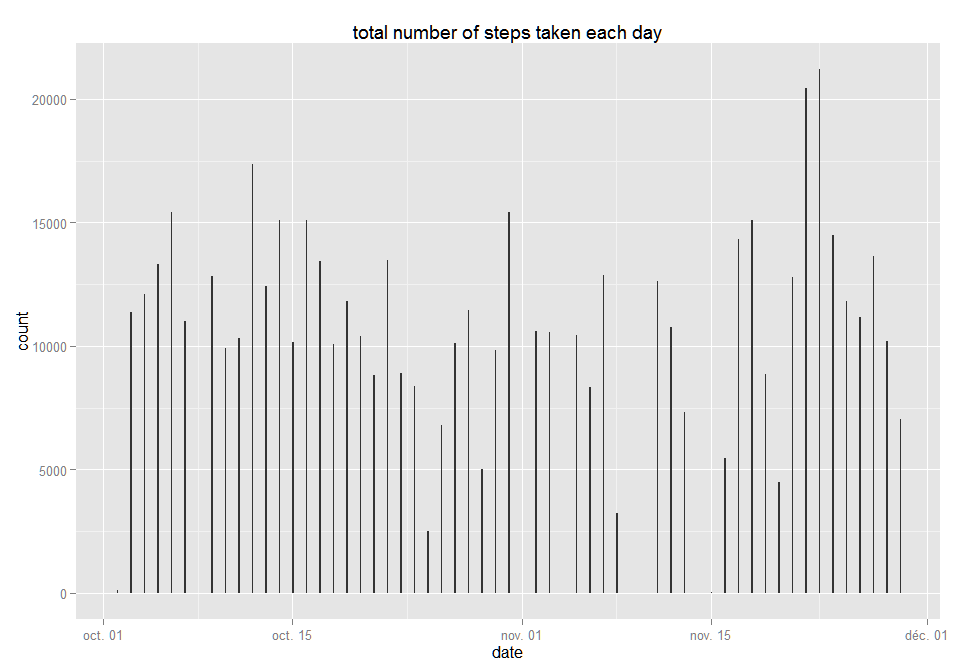

# Reproducible Research Project 1
brigasnuncamais Tuesday, May 5th, 2015  


## Loading and preprocessing the data

```r
unzip("activity.zip")
activity <- read.csv("activity.csv", colClasses = c("integer","Date","integer"), stringsAsFactors = FALSE)
```

### add a dateInterval column to concatenate date and interval columns 

```r
minutes <- formatC(activity$interval/100, 2, format = "f")
activity$dateInterval <- as.POSIXct(paste(activity$date, minutes), format = "%Y-%m-%d %H.%M", tz = "CET")
```

### add a daytime column to be able to analize average daily pattern  

```r
activity$daytime <- format(activity$dateInterval, format = "%H:%M:%S")
activity$daytime <- as.POSIXct(activity$daytime, format = "%H:%M:%S")
```

## What is mean total number of steps taken per day?

### 1. Calculate the total number of steps taken per day 

```r
nrowHisto <- aggregate(steps ~ date, data=activity, FUN = sum,na.rm = T)
```

### 2. Make a histogram of the total number of steps taken each day

```r
if (!require("ggplot2")) {
  install.packages("ggplot2")
}
```

```
## Loading required package: ggplot2
```

```r
require("ggplot2")
qplot(date, data=nrowHisto, weight=steps, geom = "histogram",binwidth = .1,
      main="total number of steps taken each day")
```

 

### 3. Calculate and report the mean and median of the total number of steps taken per day

```r
mean(nrowHisto$steps)
```

```
## [1] 10766.19
```

```r
median(nrowHisto$steps)
```

```
## [1] 10765
```
## What is the average daily activity pattern?

### 1. Make a time series plot of the 5-minute interval (x-axis) and the average number of steps taken 

```r
if (!require("scales")) {
  install.packages("scales")
}
```

```
## Loading required package: scales
```

```r
require("scales")
meansteps <- aggregate(x=list(steps=activity$steps), by=list(daytime=activity$daytime), FUN = mean,na.rm=TRUE)
lower <- with(meansteps,as.POSIXct(strftime(min(daytime),"%Y-%m-%d"),tz="CET"))
upper <- with(meansteps,as.POSIXct(strftime(as.Date(max(daytime))+1,"%Y-%m-%d"))-300)
limits = c(lower,upper)
ggplot(data=meansteps, aes(x=daytime, y=steps))  +
  geom_line()  + xlab("Day time")  +
  ggtitle("average daily activity pattern")  +
  ylab("average number of steps") +
  scale_x_datetime(breaks=("2 hour"), minor_breaks=("1 hour"), labels=date_format("%H:%M"),limits=limits)
```

 

### 2. Which 5-minute interval, contains the maximum number of steps? 

```r
format(meansteps[which.max(meansteps$steps), "daytime"], format = "%H:%M")
```

```
## [1] "08:35"
```

## Imputing missing values

### 1. total number of missing values in the dataset (i.e. the total number of rows with NAs) 

```r
sum(is.na(activity))
```

```
## [1] 2304
```

### 2. Devise a strategy for filling in all of the missing values in the dataset 
We will calculate the mean of steps for a 5 minute interval over the whole data frame.

### 3. Create a new dataset that is equal to the original dataset but with the missing data filled in 

```r
if (!require("Hmisc")) {
  install.packages("Hmisc")
}
```

```
## Loading required package: Hmisc
## Loading required package: grid
## Loading required package: lattice
## Loading required package: survival
## Loading required package: Formula
## 
## Attaching package: 'Hmisc'
## 
## The following objects are masked from 'package:base':
## 
##     format.pval, round.POSIXt, trunc.POSIXt, units
```

```r
require("Hmisc")
filledactivity <- activity
filledactivity$steps <- with(filledactivity,impute(steps, mean))
```

### 4. Make a histogram of the total number of steps taken each day 

```r
imputedsteps <- aggregate(x=list(steps=filledactivity$steps), by=list(date=filledactivity$date), FUN = sum)
mean(imputedsteps$steps)
```

```
## [1] 10766.19
```

```r
mean(nrowHisto$steps)
```

```
## [1] 10766.19
```

```r
median(imputedsteps$steps)
```

```
## [1] 10766.19
```

```r
median(nrowHisto$steps)
```

```
## [1] 10765
```

```r
qplot(x=date, weight=steps, data=imputedsteps, geom = "histogram",binwidth = .1,
      main="steps per day (with Imputed observations)")
```

 

Imputing missing data has not changed much the estimates of the total daily number of steps.

## Are there differences in activity patterns between weekdays and weekends?

### 1. Create a new factor variable in the dataset distinguishing week days from weekend

```r
Sys.setlocale("LC_ALL","C")
```

```
## [1] "C"
```

```r
filledactivity$daytype <- 
  factor(ifelse(weekdays(filledactivity$dateInterval) %in% c("Saturday","Sunday"),"weekend", "weekday"))
```

### 2. Make a panel plot 

```r
avgfilledactivity <- aggregate(steps ~ interval + daytype, data=filledactivity, mean)
ggplot(data=avgfilledactivity, aes(interval, steps)) + 
    geom_line() + 
    facet_grid(daytype ~ .) +
    xlab("Day time") + 
    ylab("average number of steps")
```

 
